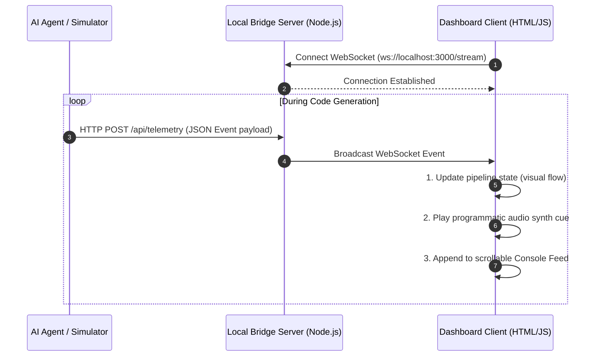
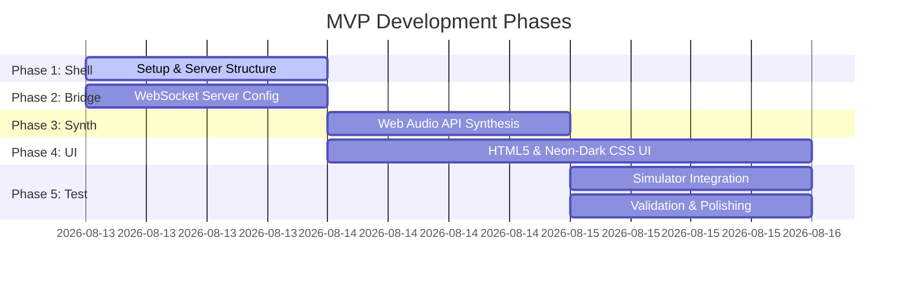

# OrchestrateLive — Detailed MVP Execution Plan

This document details the concrete execution steps to build the Minimum Viable Product (MVP) for **OrchestrateLive**. It translates the high-level plan into code structures, APIs, and design tokens.

---

## 1. System Architecture & Data Flow

OrchestrateLive runs completely on the user's local machine. The workflow consists of three primary components:
1. **Telemetry Producer (AI Agent / Simulator):** Emits JSON event logs to the Bridge Server.
2. **Bridge Server (Node.js):** Receives event logs via HTTP POST and broadcasts them to the dashboard via WebSockets.
3. **Dashboard (HTML5/CSS3/JS):** Renders the visual telemetry pipeline and synthesizes audio cues in real time.

### Telemetry Pipeline Diagram


---

## 2. Telemetry Schema Specification

To ensure robust communication, all telemetry events sent to `/api/telemetry` must conform to the following JSON structure:

```json
{
  "timestamp": "2026-08-13T11:55:00.000Z",
  "event": "thinking | planning | executing_tool | task_done | task_error",
  "message": "Brief human-readable message of current activity",
  "metadata": {
    "tool_name": "write_to_file | run_command | grep_search",
    "target": "src/app/page.tsx",
    "elapsed_seconds": 12,
    "tokens_per_sec": 45.2,
    "context_pct": 82
  }
}
```

### Event State Mapping Table
| Event Type | Active Pipeline State | Visual Highlight Color | Synthesizer Audio Cue |
| :--- | :--- | :--- | :--- |
| `thinking` | **Thought** Node | Glowing Cool Cyan (HSL 190, 90%, 50%) | Soft Sine wave ping (440Hz) with 0.4s decay |
| `planning` | **Planning** Node | Glowing Deep Amber (HSL 35, 90%, 55%) | Modulated Pitch Sine wave (440Hz -> 660Hz) |
| `executing_tool` | **Tool Execution** Node | Glowing Cobalt Blue (HSL 210, 90%, 55%) | Crisp double-click sound (1000Hz clicks, 0.05s) |
| `task_done` | **Done** Node | Glowing Jade Green (HSL 145, 80%, 45%) | High-fidelity dual-tone chime (C5 & E5) |
| `task_error` | **Error State** (All) | Glowing Ruby Red (HSL 0, 85%, 50%) | Low, warm descending warning tone (180Hz -> 120Hz) |

---

## 3. Directory Layout

The MVP will be structured inside a dedicated dashboard directory:

```
orchestrate-live/
├── server/
│   ├── package.json            # Server dependencies (express, ws)
│   ├── server.js               # Bridge server implementation
│   └── simulate.js             # Simulation script for development testing
├── public/
│   ├── index.html              # Main dashboard frontend structure
│   ├── style.css               # Vanilla CSS design tokens & animations
│   ├── app.js                  # Frontend state coordinator & WebSocket listener
│   └── audio-engine.js         # Web Audio API programmatic synthesizer
└── README.md                   # Setup and usage instructions
```

---

## 4. Phase-by-Phase Execution Plan



### Phase 1: Project Setup & Package Initialization
Initialize the workspace structure. Keep dependencies to a bare minimum.
- Create `/server/package.json` with only `express` and `ws` as dependencies.
- Install packages using local package manager `npm install`.

### Phase 2: Implement local Bridge Server (`server.js`)
Build a standard Node.js server.
- Instantiate an HTTP server listening on port `3000`.
- Bind a WebSocket server (`ws`) to the same HTTP server on `/stream`.
- Implement a `POST /api/telemetry` endpoint that:
  - Validates the incoming payload.
  - Immediately broadcasts it to all active WebSocket clients.
- Provide a `GET /` fallback serving the contents of the `/public` folder for single-command start-up.

### Phase 3: Web Audio API Synth Engine (`audio-engine.js`)
Develop a pure Javascript class `AudioTelemetryEngine` that executes audio cues on-demand without asset requests:
- Initialize the browser `AudioContext` on user interaction (UX requirement).
- Use `OscillatorNode` (sine/triangle waves) and `GainNode` for envelopes.
- **Thinking Sound:** `OscillatorNode` (Sine, 440Hz), linear ramp gain to `0` over `0.3` seconds.
- **Executing Tool Sound:** Two short click pulses spaced `0.08` seconds apart. Use high-pass filter and noise or high sine wave at 1200Hz lasting `0.02` seconds each.
- **Task Done Sound:** Create two overlapping oscillators at `523.25Hz` (C5) and `659.25Hz` (E5) fading out over `0.6` seconds.
- **Error Sound:** Descending frequency sweep using standard linear/exponential audio ramps.

### Phase 4: Visual Dashboard UI (`index.html`, `style.css`, `app.js`)
Draft a premium UI aligned with visual guidelines.
- **Design Tokens (CSS Variables):**
  - Background: Deep Obsidian Dark Mode (`#09090b` / HSL 240, 10%, 4%)
  - Card Surfaces: Charcoal Slate (`#18181b` / HSL 240, 5%, 10%)
  - Accent/Status Colors: HSL based (Cyan, Amber, Blue, Green, Red).
  - Fonts: Inter (sans-serif) & JetBrains Mono (monospace) for telemetry text.
- **Layout Panels:**
  - *Header Stats:* Key metrics horizontally distributed: Latency (ms), Speed (tokens/s), Context Window %, Audio Mute Toggle.
  - *Pipeline Map:* Centered panel containing 4 node elements. Rather than glowing borders, nodes will feature a modern circular state indicator (similar to a recording light) that pulses when active, and changes HSL colors depending on the step. Use simple CSS flexbox.
  - *Activity Console:* A terminal-style viewport displaying chronological log entries. Format lines conditionally (e.g., wrap tools in monospace badge blocks).

### Phase 5: Integration & Simulation Script (`simulate.js`)
Construct a CLI testing script that acts as an AI coding agent.
- Sequence: Send `thinking` -> Send `planning` -> Send `executing_tool` (multiple steps for file-writes and terminal calls) -> Send `task_done`.
- Include realistic logs, e.g., `"Replacing file content in src/app/utils.ts..."`, `"Running lint check..."`.
- Utilize standard timeouts between steps (e.g., 1.5s - 3s) to simulate natural agent behavior.

---

## 5. Implementation Validation Checklist

Before finalizing the MVP, the system must be verified against these key checkpoints:

- [ ] **Zero Asset Overhead:** Verify that page load makes 0 network calls for audio files (all synthesized programmatically).
- [ ] **No Page Jitter:** Ensure the Console Feed scroll-anchors to the bottom smoothly when new logs arrive, preventing UI layout shifting.
- [ ] **Audio Safety Lock:** Audio remains completely muted until the user explicitly clicks the "Enable Audio Telemetry" button.
- [ ] **Browser Compatibility:** Web Audio context successfully resumes after a user interaction on Chrome, Edge, and Safari.
- [ ] **Local Resiliency:** The frontend dashboard gracefully attempts to reconnect (e.g., exponential backoff) if the Bridge Server is restarted.

---

## 6. Execution Command Quick-Reference

Commands to initialize and start the system for local testing:

```bash
# Initialize and install dependencies
cd server
npm init -y
npm install express ws

# Start the Bridge Server and serve frontend
node server.js

# In a separate terminal, trigger simulated agent logs
node simulate.js
```
